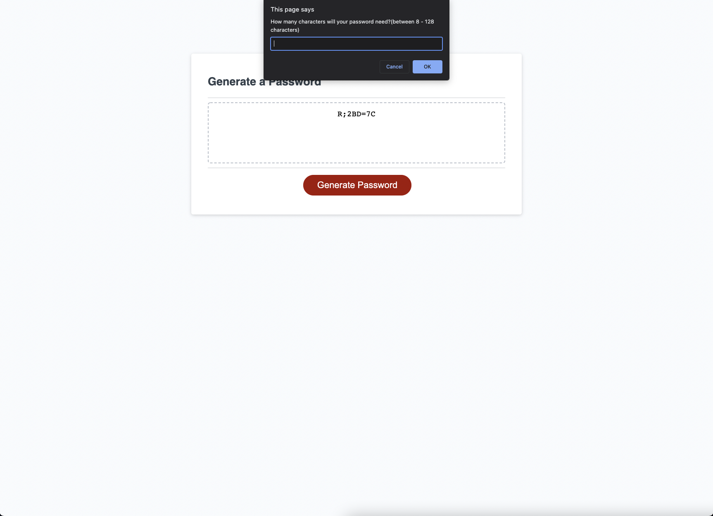

#Javascript Password Generator

Password generator with the ability to choose the use of lower case, upper case, and special characters as well as numbers. Capable of generating random passwords with 8 or up to 128 characters.

[Deployed Application Link](https://parinthalangdee.github.io/Module-3-Challenge/)

